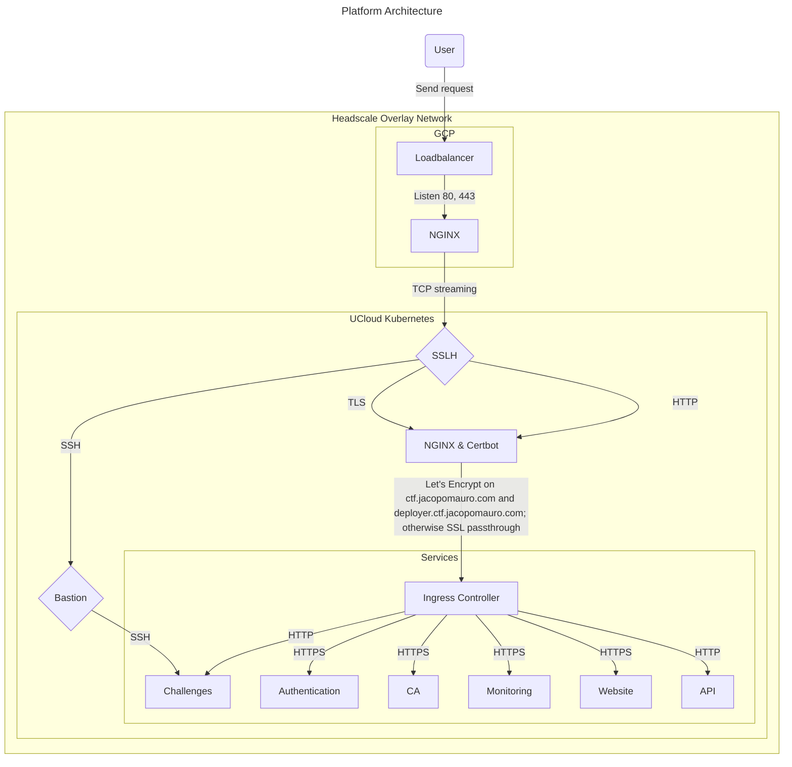
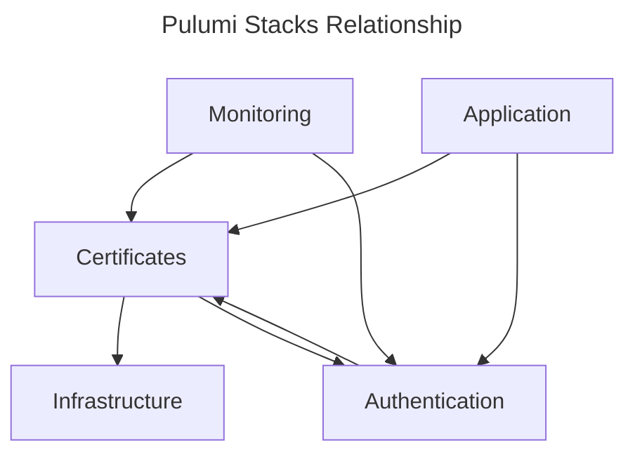
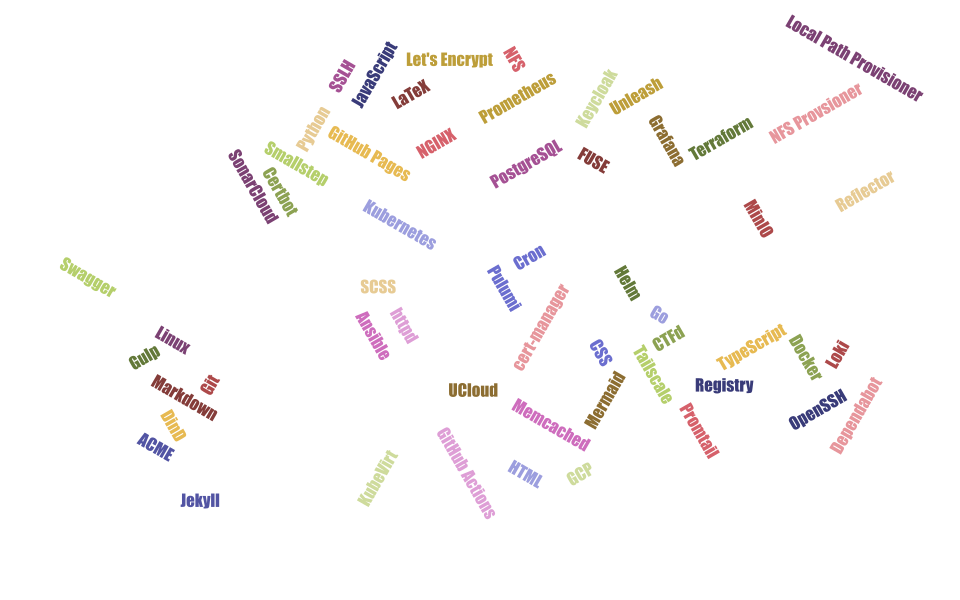

<a name="readme-top"></a>
<p align="center">
<a href="https://sonarcloud.io/summary/overall?id=KianBankeLarsen_CTF-Platform" style="text-decoration:none;">
  
</a>
<a href="https://sonarcloud.io/summary/overall?id=KianBankeLarsen_CTF-Platform" style="text-decoration:none;">
  
</a>
<a href="https://sonarcloud.io/summary/overall?id=KianBankeLarsen_CTF-Platform" style="text-decoration:none;">
  
</a>
<a href="https://github.com/KianBankeLarsen/CTF-Platform/blob/main/LICENSE" style="text-decoration:none;">
  
</a>
<!-- <a href="https://ctf.jacopomauro.com" style="text-decoration:none;">
  
</a> -->
</p>
<p align="center">
<a href="https://odin.sdu.dk/sitecore/index.php?a=fagbesk&id=83401&lang=en&listid=">

</a>
<br />
Revolutionize Your CTF Challenges with Our Easy Deployment Platform
<br />
<a href="https://ctf.jacopomauro.com"><strong>Explore the platform»</strong></a>
</p>

<details>
  <summary>Table of Contents</summary>
  <ol>
    <li>
      <a href="#introduction">👋 About The Project</a>
    </li>
    <li>
      <a href="#requirements">🧐 Requirements</a>
    </li>
    <li>
      <a href="#project-structure">📂 Project Structure</a>
    </li>
    <li>
      <a href="#getting-started">👷‍♂️ Getting Started</a>
    </li>
    <li>
      <a href="#usage">🪁 How to Use the Platform</a>
    </li>
    <li>
      <a href="#ucloud">☁️ Deploy to UCloud</a>
    </li>
    <li>
        <a href="#license">📜 License</a>
    </li>
  </ol>
</details>

<a name="introduction"></a>
## 👋 About The Project
The driving force behind this Master's Thesis is the urgent need for a robust and secure Capture The Flag (CTF) platform. CTF competitions are designed to test participants' knowledge and skills across various aspects of information security. These events serve not only as educational tools but also as team-building exercises and recruitment opportunities for cybersecurity talent. As these challenges grow increasingly complex, both educational institutions and organizations are in search of effective methods to train students and professionals in offensive and defensive cybersecurity techniques. This thesis seeks to address this need by developing an innovative CTF platform.

To give you a comprehensive view of our system’s architecture, here is a high-level diagram illustrating the various components and their interactions:




This figure showcases the interconnectedness and complexity of our platform, highlighting how each part plays a vital role. From infrastructure setup and application management to monitoring and authentication, the diagram encapsulates the multifaceted nature of the system. Each component is designed to ensure modularity, scalability, and efficiency, forming a cohesive and robust deployment ecosystem.

Please read the [report](report/main.tex) for a more in-depth review.

This platform has been developed in collaboration with:

1. Jacopo Mauro: Master's Thesis Supervisor and Professor, guiding the project's vision and academic rigor.
2. Matteo Trentin: Computer Science PhD Student, contributing research and technical expertise.
3. Henrik Jakobsen, Computer Science Master's Student.
4. Kian Larsen (me), Computer Science Master's Student.

<p align="right">(<a href="#readme-top">back to top</a>)</p>

<a name="requirements"></a>
## 🧐 Requirements
Ready to dive into deploying your platform? Fantastic! Whether you're gearing up for a local run or a full-scale production, here’s your must-have toolkit:

* [Minikube](https://minikube.sigs.k8s.io/docs/start/?arch=%2Flinux%2Fx86-64%2Fstable%2Fdebian+package): The local Kubernetes cluster you've been dreaming of.
* [Node](https://github.com/nvm-sh/nvm): Your JavaScript runtime for building scalable network applications.
* [npm](https://docs.npmjs.com/downloading-and-installing-node-js-and-npm): The essential package manager for Node.js.
* [Pulumi](https://www.pulumi.com/docs/install/): Infrastructure as code, simplified. It provides a pipeline-like experience, making your deployments feel smooth and automated.
* [Kubectl](https://kubernetes.io/docs/tasks/tools/install-kubectl-linux/): The command-line tool for interacting with your Kubernetes cluster.
* [Docker](https://www.docker.com/): Containerize and run your applications seamlessly.
* [Helm](https://helm.sh/docs/intro/install/): The package manager for Kubernetes.
* [virtctl](https://kubevirt.io/user-guide/user_workloads/virtctl_client_tool/): The command-line tool for interacting with KubeVirt.
* [step CLI](https://smallstep.com/docs/step-cli/installation/): Boostrap CA and request personal SSH certificates.
* [Git](https://git-scm.com/downloads): The distributed version control system that tracks changes in your code, collaborates with other developers, and manages your project history.

Once you've got these tools locked and loaded, you're all set to deploy the platform! 🛠️🚀

Note: It might look like a hefty list of dependencies at first glance, but don’t sweat it. Most of these tools are standard for any Kubernetes setup. Minikube is only needed for local development, and trust me, Typescript Pulumi makes deployment and development a walk in the park. 🌳

<p align="right">(<a href="#readme-top">back to top</a>)</p>

<a name="project-structure"></a>
## 📂 Project Structure

Welcome to the heart of our platform! 💓 Understanding the project structure is crucial for smooth deployment and maintenance. Here's a peek into the layout (only *important* files are shown):

```bash
CTF-Platform/
├── scripts/
│   └── boostrap.sh
├── src/
│   ├── application/
│   │   ├── bastion/
│   │   │   ├── Dockerfile
│   │   │   ├── init.sh
│   │   │   └── sshd_bastion.conf
│   │   ├── challenges/
│   │   │   ├── backend/
│   │   │   └── frontend/
│   │   ├── ctfd/
│   │   │   ├── oidc
│   │   │   └── Dockerfile
│   │   ├── nginx/
│   │   │   ├── Dockerfile
│   │   │   ├── entrypoint.sh
│   │   │   ├── nginx-certbot.conf
│   │   │   ├── nginx-http.conf
│   │   │   └── nginx-https.conf
│   │   ├── vm/
│   │   │   ├── Dockerfile.container
│   │   │   ├── Dockerfile.vm
│   │   │   ├── get_vm.py
│   │   │   └── requirements.txt
│   │   ├── welcome/
│   │   │   ├── neumorphism/    
│   │   │   ├── Dockerfile
│   │   │   ├── entrypoint.sh
│   │   │   └── nginx.conf
│   │   ├── vm-feature-flag.json
│   │   └── index.ts
│   ├── authentication/
│   │   ├── index.ts
│   │   └── realm.json
│   ├── certificates/
│   │   └── index.ts
│   ├── infrastructure/
│   │   └── index.ts
│   ├── monitoring/
│   │   └── index.ts
│   └── utilities/
│       └── src/
│           ├── deployment.ts
│           ├── index.ts
│           ├── ingress.ts
│           ├── misc.ts
│           └── service.ts
└── ucloud-k8s/
    ├── ansible/
    ├── ansible-gcp/
    └── terraform/
```

Our project consists of five Pulumi projects, each with a specific role to play:

* **application:** 🖥️ Home to CTF platform/cloud-specific functionality.
  * **Homepage**: A user guide for navigating and utilizing the platform.
  * **SSHD Alpine bastion:** A secure SSHD server based on Alpine Linux, serving as a bastion host for your cloud environment.
  * **CTFd:** A CTF platform for hosting cybersecurity challenges and competitions.
  * **Henrik Backend:** The backend service providing core functionality and APIs for the platform.
  * **SSLH protocol multiplexer:** A protocol multiplexer that allows multiple services to share a single port, such as SSH and HTTPS.
  * **NGINX Proxies**: Proxies to upgrade connection and/or move SSL termination to pod.
  * **Unleash**: An open-source solution for feature flagging.
* **authentication:** 🔑 Manages SSO capabilities provided by Keycloak.
  * **Keycloak:** An open-source identity and access management solution for Single Sign-On (SSO), enabling secure authentication and authorization.
* **certificates:** 📜 Handles certificate CA and issuers.
  * **Step Certificates:** A Certificate Authority (CA) toolkit for managing and issuing certificates within your environment.
  * **Step Autocert:** Automates the issuance and renewal of TLS certificates to ensure your services remain secure.
  * **Step Issuer:** An issuer that integrates with Cert-Manager to manage certificate lifecycles.
  * **Cert-Manager:** A Kubernetes add-on to automate the management and issuance of TLS certificates from various issuing sources.
* **infrastructure:** 🏗️ Takes care of basic cluster configuration.
  * **Rancher Local Path Storage Provisioner:** Manages dynamic storage provisioning for Kubernetes using local paths on nodes.
  * **Nginx Ingress Controller:** Manages external access to services in a Kubernetes cluster through HTTP and HTTPS.
  * **KubeVirt:** Extends Kubernetes by adding support for running virtual machine workloads alongside container workloads.
* **monitoring:** 📊 Ensures cluster observability and log collection.
  * **Prometheus:** A monitoring system and time-series database for capturing metrics and alerts.
  * **Prometheus-Operator:** Simplifies the setup and management of Prometheus instances within Kubernetes.
  * **Grafana:** An open-source platform for monitoring and observability, providing dashboards and visualizations for your metrics.
  * **Loki:** A log aggregation system designed for efficiency and ease of use, seamlessly integrating with Prometheus.
  * **Promtail:** An agent that ships the contents of local logs to a Loki instance.
  * **Node-exporter:** Exports hardware and OS metrics exposed by Linux kernels for monitoring.

Each project is a bundle of deployments, services, and even Helm charts. They are designed to group similar services that share characteristics, ensuring modularity and maintainability.

The relationship between the stacks is illustrated below. An arrow pointing from a source to a target indicates that the source depends on the target. Since this is a layered approach, these relationships are also transitive (not drawn for simplicity).



As a rule of thumb, whenever something towards the bottom is updated or modified, everything above should be restarted to cascade the changes or update dependencies. This means that performing tasks like password rotation in the infrastructure stack or updating the CA can become tedious.

<p align="right">(<a href="#readme-top">back to top</a>)</p>

<a name="getting-started"></a>
## 👷‍♂️ Getting started
If this is your first time using Pulumi, fear not—the setup process is straightforward. For accessing config secrets, you will need to enter a passphrase to decrypt the passwords using the encryption salt. If you know the passphrase, you can use the provided secrets. 🔑

You might want to set this environment variable in your `~/.bashrc` file to avoid being prompted every time you work with config secrets:

```bash
export PULUMI_CONFIG_PASSPHRASE=<passphrase>
```

If you do not know the passphrase, you can create your own stack from scratch with a new passphrase. However, you will need to generate your own secrets, as the provided ones will be unavailable. 🛡️ You can always change the passphrase later using the command:

```bash
pulumi stack change-secrets-provider passphrase
# This will prompt you to enter the current passphrase and then a new one.
```

If this is your first time deploying the platform, you'll need to initialize the stacks. Pulumi projects can store their state in either an external BLOB or a local state file. You will need to `pulumi login` to use either. To use a local state file, run:

```bash
pulumi login --local
```

Regardless, you'll need to initialize the stacks to ensure they are part of your state. Do this by running:

```bash
pulumi stack init <stack>
```

🤔 You might wonder, what is a stack? A stack is simply some state of resources. Stacks can also contain values similar to Helm chart values. There are two predefined stacks available: `dev` and `ucloud`. We use these stacks like environments, where `dev` is for development (specifically targeting Minikube), and `ucloud` is meant for any Kubernetes cluster, e.g., K3 or K8. If needed, you can create your own stack from scratch.

Before you start deploying, you'll need to install the Node modules. These modules can be specific for Pulumi, or any Node module you may want to use (e.g., axios). Install these modules by navigating to the `src` directory and running:

```bash
npm install
```

Now for the fun part—deployment! 🚀 To deploy a project, change the directory to that project and then run:

```bash
cd src/<project>
pulumi up --stack <stack> -y
```

🌟 If you prefer not to specify the stack every time, you can set the stack context with the following command:

```bash
pulumi select stack <stack>
```

This stack will then be the default context moving forward.

**Important Tips:**

1. **Infrastructure First:** 🏗️ Start with the infrastructure project as it sets up the basic cluster configuration and Kubernetes resources like namespaces.
2. **Certificates Next:** 📜 Deploy the certificates project next; otherwise, the services using certificates won't work.
3. **Order Flexibility:** 🔄 After setting up infrastructure and certificates, feel free to deploy the remaining projects in any order. Once deployed, they can be updated independently.

❗During the deployment of the application stack, Pulumi will build Docker images and push them to a self-hosted registry. Since Minikube operates differently from a standard Kubernetes cluster, you will need to configure a host name on your local machine (as localhost cannot be used). The required hostname can be found in the `Pulumi.dev.yaml` file. While you might need to configure other hostnames, they are not necessary for a successful deployment and are only required when interacting with the services.

🛠️ By following this structured approach, you'll ensure a smooth and efficient deployment process. Pulumi not only creates Kubernetes resources but also executes bash commands to handle procedures that would otherwise require manual intervention. This approach solves issues like the circular dependency between certificates and authentication. For example, the CA performs some initialization (only once) of its specified providers, necessitating a restart of the CA pod after Keycloak is deployed. Pulumi also builds and pushes Docker images to the self-hosted Docker registry as part of the deployment. These examples highlight why using Pulumi makes our lives simpler.

For even more advanced setups, if using a provider, the complete infrastructure can be specified in code and executed with a click of a button! While only some cloud providers support this natively, you can always create your own provider.

💡 If you're working on local development and Pulumi alone isn't quite enough, you can leverage the prepared Visual Studio Code Tasks tailored for deploying or destroying the Pulumi projects. These tasks allow you to deploy or destroy everything or focus on single projects. They are particularly handy when you need to boot everything up at the start of a new coding session. ⚡

<p align="right">(<a href="#readme-top">back to top</a>)</p>

<a name="usage"></a>
## 🪁 How to Use the Platform

Once the platform is deployed, the main guide will be available on the [homepage](https://ctf.jacopomauro.com). This comprehensive guide includes:

- **Links to Different Services:** Easily navigate to various services provided by the platform.
- **API Usage Guide:** Learn how to interact with the platform's API.
- **SSH Connection Guide:** Detailed instructions on how to connect to challenges using SSH.

For detailed information on how to deploy challenges, refer to the [Challenge Building Info](./challenge_building_info.md) document. This file contains all the necessary steps and best practices to create and deploy challenges effectively.

<p align="right">(<a href="#readme-top">back to top</a>)</p>

<a name="ucloud"></a>
## ☁️ Deploy to UCloud
Deploying our platform onto UCloud is straightforward with our Ansible script. This script sets up the Kubernetes cluster, installs Tailscale, and deploys the Pulumi stacks, making the whole process smooth and efficient.

We're also using [GitHub Actions](https://github.com/KianBankeLarsen/CTF-Platform/actions/workflows/ucloud-deploy.yml) in the main-wrapping repository to automate our CI/CD workflows. This helps keep everything up-to-date and running smoothly.

For detailed setup instructions and more information, check out the [ucloud-k8s](./ucloud-k8s/README.md) README.

<p align="right">(<a href="#readme-top">back to top</a>)</p>

<a name="license"></a>
## 📜 License

Distributed under the MIT License. See [LICENSE](./LICENSE) for more information.

<p align="right">(<a href="#readme-top">back to top</a>)</p>

---

<center>

</center>
