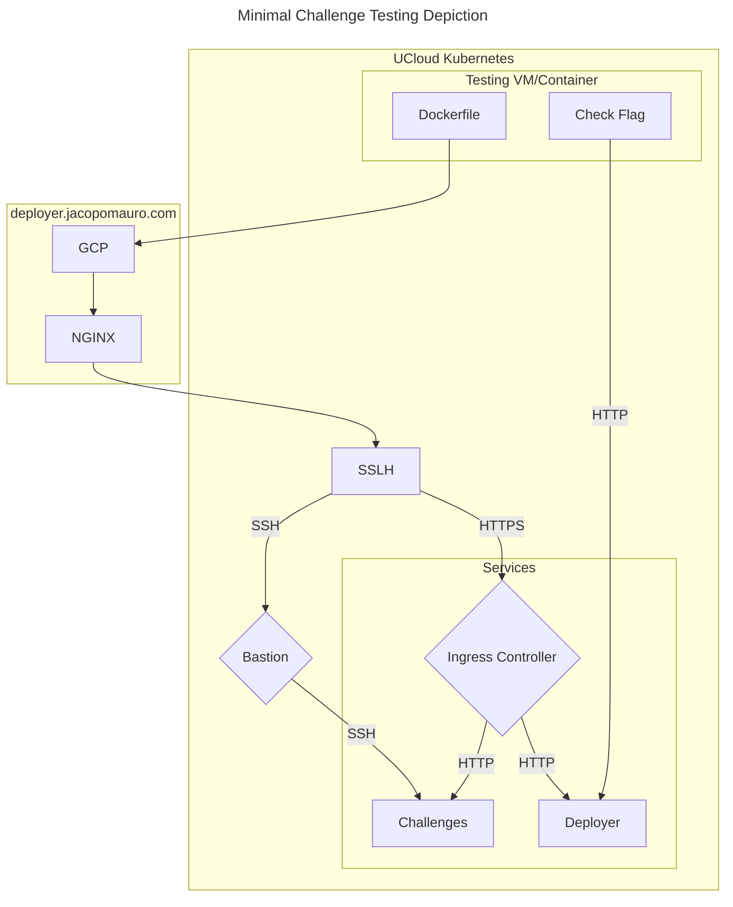

# Testing Endpoint Guide

This guide introduces the testing endpoint available on the Deployer Service. The endpoint offers a straightforward way to verify that your challenge behaves as expected. It should be viewed more as a verification tool rather than a test that must be passed. Your challenge can be deployed regardless, but you'll receive a verification badge upon successful completion.

The endpoint you'll use is:

```
https://deployer.ctf.jacopomauro.com/test-challenge/<challenge-id>
```

Before using this endpoint, ensure you've already submitted your challenge to the Deployer Service. You'll need the challenge ID provided upon submission and must authenticate using the access token, just as with any other provided endpoint.

To use this endpoint, make a POST request with the code you wish to run as a built `.tar` Dockerfile. The test will utilize the already deployed challenge if it's manually started, or it will start the challenge as part of the test. If the test initiates the challenge, it will automatically stop once the test completes.

Develop the code in the Dockerfile to interact with the platform from the outside. The domain will be provided as an environment variable named `DOMAIN`. You can expect to have the same environment variables available in your Dockerfile as in your challenge.



Once the developed code extracts the challenge flag, write it to a TXT file stored in the folder `/solution`. The flag will then be submitted and checked using a downstream script, which is part of the testing framework's hidden mechanics (this is the check flag box shown above). Your only concern is to develop the Dockerfile. The Figure is just provided for context.